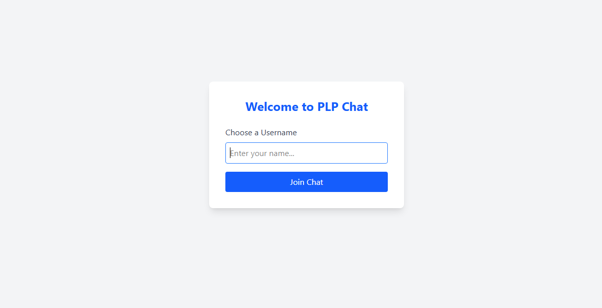
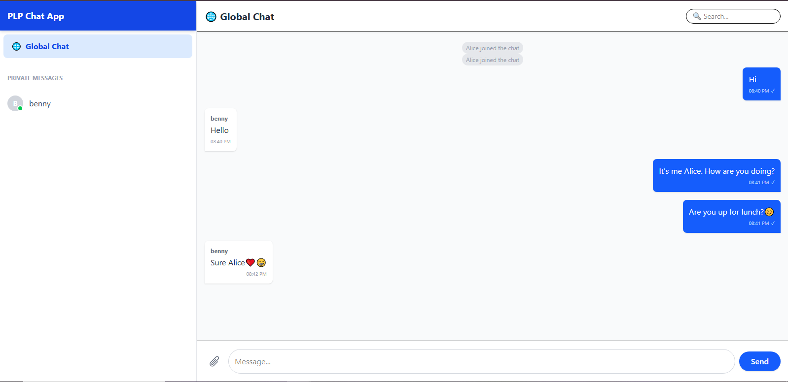
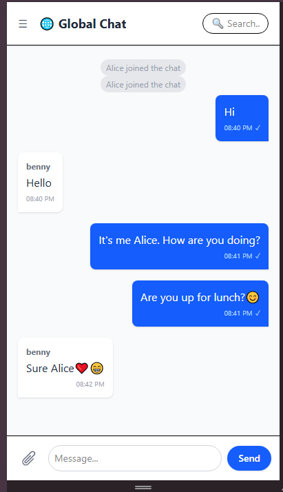

# Real-Time Chat — Socket.io + React

This repository contains a real-time chat application built with Socket.io (server) and a React + Vite client. It demonstrates bidirectional messaging, typing indicators, private messages, and a live user list.

**Screenshots**

- **Login screen**
  
- **Chat screen**
  
- **Responsive / small-screen view**
  

**Features**

- Real-time public messaging using Socket.io
- Typing indicators (shows who is typing)
- Private messaging between users
- Live user list and join/leave notifications
- Simple in-memory message history (keeps recent messages)

**Tech Stack**

- Server: Node.js, Express, Socket.io
- Client: React, Vite, socket.io-client
- Dev tooling: nodemon (dev server), Vite (client dev server)

**Prerequisites**

- Node.js (LTS recommended) and `npm` installed
- Modern browser (Chrome, Edge, Firefox)

**Repository layout (important files)**

- `server/` — Node server and Socket.io logic (`server.js`)
- `client/` — React + Vite front-end
- `screenshots/` — images embedded above
- `Week5-Assignment.md` — assignment instructions

## Getting the project running

Open two terminals (one for the server, one for the client).

1. Start the server

PowerShell commands:

```powershell
cd <repo-root>
cd server
npm install
# Start server directly (the repo includes `server.js` in the server folder)
node server.js

# (Optional) If you prefer auto-reload during development:
# npm install --save-dev nodemon
# npx nodemon server.js
```

Note: The server's `package.json` currently references `src/server.js` in its scripts. If `npm start` or `npm run dev` fails, run `node server.js` as shown above. If you want, I can patch `server/package.json` to fix the `start` script.

2. Start the client (React + Vite)

```powershell
cd <repo-root>
cd client
npm install
npm run dev
```

Vite will print the local dev URL (usually `http://localhost:5173`). Open that in your browser. By default the server expects the client at `http://localhost:5173` but the server accepts a `CLIENT_URL` env var.

## Environment variables

- Create a `.env` file in `server/` to override defaults (optional):

```
PORT=5000
CLIENT_URL=http://localhost:5173
```

API endpoints (for quick testing)

- `GET /api/messages` — returns recent messages
- `GET /api/users` — returns connected users

## How to use

- Open the client in your browser
- Enter a username to join the chat
- Send messages in the public room; use the private message UI to message a specific user
- Typing indicators and live user updates will appear automatically

## Troubleshooting

- If you see CORS or connection issues, ensure the server `CLIENT_URL` matches the client dev URL (usually `http://localhost:5173`).
- If `npm start` in `server/` fails with `Cannot find module 'src/server.js'`, run `node server.js` instead or I can update the `package.json` script to `node server.js`.

## License

This project is provided for learning and assignment purposes. Check the assignment/organization license if applicable.
